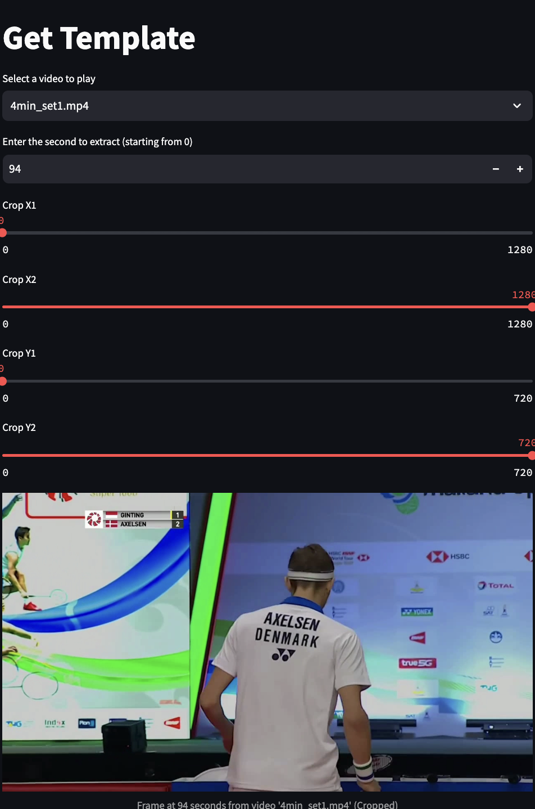
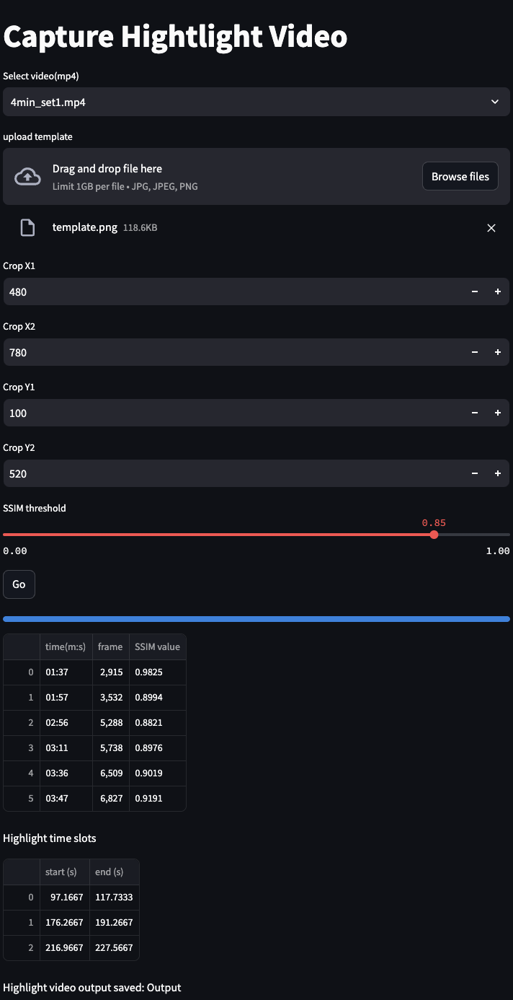

# Badminton-Highlight-Capture

## 內容

從 MP4 影片中提取幀，將這些幀與提供的範本圖像進行結構相似度指數（SSIM）比較，並根據相似度閾值檢測高亮區域，然後剪裁檢測到的高亮區域並儲存為新檔案。

## 環境要求

安裝所需的庫：

```bash
pip install streamlit opencv-python pillow scikit-image pandas numpy
```

## 使用說明

1. **啟動應用程式**

   使用以下命令啟動 Streamlit 應用程式：

   ```bash
   streamlit run main.py
   ```

2. **從影片中獲得範本**

   - **選擇影片**：從指定資料夾中的 MP4 影片列表中選擇一部影片。
   - **輸入時間**：輸入要提取的幀的秒數（從開始算起）。
   - **設置裁剪區域**：定義裁剪區域的 X 和 Y 坐標。
   - **顯示幀**：查看提取和裁剪後的幀。

3. **捕捉Highlight影片**

   - **上傳範本**：上傳一個圖片檔案（JPG、JPEG、PNG）作為比較用的範本。
   - **設置裁剪區域**：定義用於比較的影片幀的裁剪區域。
   - **調整 SSIM 閾值**：設置 SSIM 閾值，以確定檢測高亮所需的相似度。
   - **計算高亮**：點擊「開始」以啟動檢測過程。應用程式將處理每一幀，計算 SSIM 值，並根據閾值檢測高亮區域。

4. **查看結果**

   - **高亮表格**：查看顯示檢測到的高亮時間和 SSIM 值的表格。
   - **高亮時段**：查看高亮發生的影片時段。


## 使用範例

1. **取得範本 get_template.py：**

2. **捕捉高亮影片 main.py：**


## 注意事項

- 確保影片資料夾路徑和輸出資料夾路徑設置正確。
- 確保上傳的範本圖像與影片幀具有相同的長寬比，以確保準確比較。
- 根據實際需求調整 SSIM 閾值和裁剪區域。

