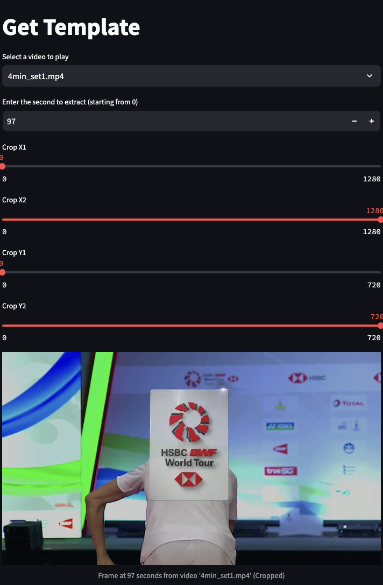

# Badminton Highlight Capture Tool

## 任務

從羽球比賽影片中擷取轉場畫面，用轉場畫面作為範本，把影片的每一幀與範本圖像進行結構相似度指數（SSIM）比較，擷取精彩回放的慢動作回放並儲存為新檔案

## 環境要求

安裝所需的library：

```bash
pip install streamlit opencv-python pillow scikit-image pandas numpy
```

## 使用說明

1. **啟動應用程式**

   使用以下命令啟動 Streamlit 應用程式：

   ```bash
   streamlit run main.py
   ```

2. **從影片中獲得轉場畫面**

   - **選擇影片**：從指定資料夾中的 MP4 影片列表中選擇一部影片。
   - **輸入時間**：輸入要轉場畫面出現的秒數。
   - **設置裁剪區域**：用X 和 Y 坐標 裁剪轉場logo區域。
   - **顯示幀**：查看裁剪後的效果。

3. **擷取精彩回放影片**

   - **上傳範本**：上傳一個圖片（JPG、JPEG、PNG）作為比較用的轉場畫面(範本)。
   - **設置裁剪區域**：用X 和 Y 坐標 裁剪與範本相同的區域。
   - **調整 SSIM 閾值**：設置 SSIM 閾值。
   - **計算高亮**：處理每一幀，計算 SSIM 值，並根據閾值檢測高亮區域。

4. **查看結果**

   - **高亮表格**：查看顯示檢測到的高亮時間和 SSIM 值的表格。
   - **高亮時段**：查看高亮發生的影片時段。


## 使用範例

1. **取得範本 get_template.py：**

2. **捕捉高亮影片 main.py：**


## 注意事項

- 確保影片資料夾路徑和輸出資料夾路徑設置正確。
- 確保上傳的範本圖像與影片幀具有相同的長寬比。
- 根據實際需求調整 SSIM 閾值和裁剪區域。

